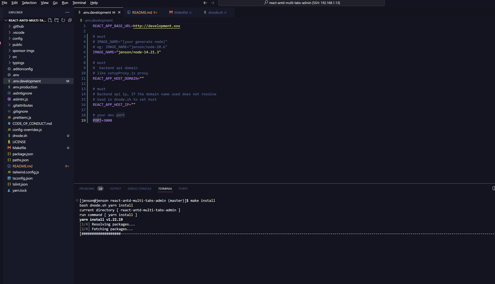
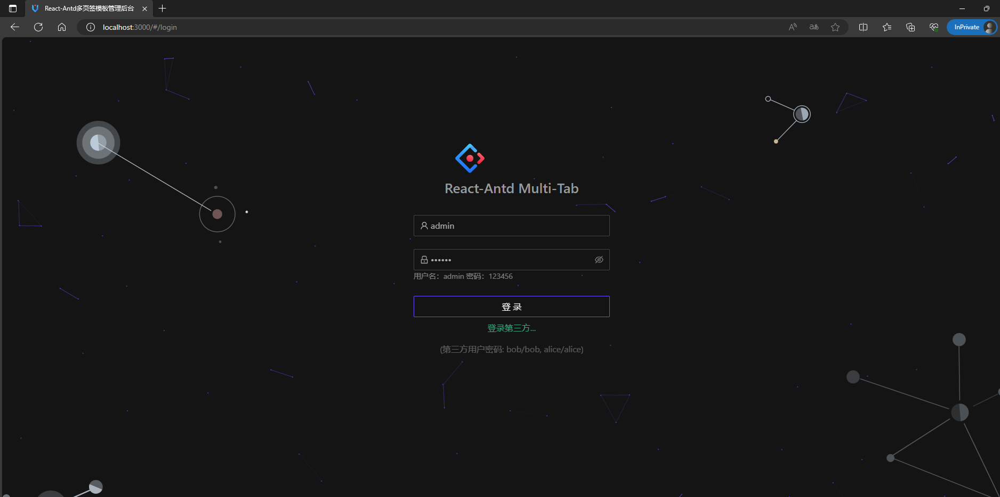

<!-- @import "[TOC]" {cmd="toc" depthFrom=1 depthTo=6 orderedList=false} -->

<!-- code_chunk_output -->

- [Docker 安装 Node](#docker-安装-node)
  - [关于](#关于)
  - [目录结构](#目录结构)
  - [构建Node版本](#构建node版本)
  - [使用](#使用)
  - [例子](#例子)

<!-- /code_chunk_output -->

# Docker 安装 Node

## 关于

解决日常开发中的 Node 多版本问题

## 目录结构

1. `react`  React相关的配置脚本文件
1. `vue`  Vue相关的配置脚本文件
1. `Dockerfile`  Node Docker 构建文件
1. `Makefile`

## 构建Node版本

1. 参数
    1. `NODE_VERSION` node版本
        - [请参照](https://hub.docker.com/_/node/tags?page=1&name=alpine) <https://hub.docker.com/_/node/tags?page=1&name=alpine>
        NODE_VERSION?=20.6.0-alpine3.18
    1. `IMAGE_NAME` 镜像名字
        - eg `NODE_VERSION=20.6.0-alpine3.18` 比如我就将镜像名称设置为 jenson/node-20.6.`
1. 命令
    - `make add` // 创建默认参数node镜像
    - `make add NODE_VERSION=20.6.0-alpine3.18 IMAGE_NAME=jenson/node-20.6`

    > Dockerfile 会检查版本，并自动选择合适的 Python 版本来创建。
    > 最好选择 3.15 版本进行构建。如果选择高于 3.15 的 Alpine 版本，Python 将是 Python 3。这主要是为了解决与之前 Node-sass 编译的兼容性问题。

1. 请记住已构建镜像的名称，例如：jenson/node-17.5。您需要在下面使用 IMAGE_NAME。

## 使用

1. 根据项目框架（vue 或 react）选择相应的配置目录。
1. **如果目标项目中已经有该文件，请手动添加。否则，只需复制即可。**
1. 根据 env.development.example 中的注释，将其配置到 .env.development 中。
1. `make help` 显示帮助命令

## 例子

1. 添加需要运行的node版本 `make add NODE_VERSION=14-alpine3.17 IMAGE_NAME=jenson/node-14`
1. 克隆 [测试项目](https://github.com/hsl947/react-antd-multi-tabs-admin)
    - `git clone https://github.com/hsl947/react-antd-multi-tabs-admin.git`
1. 复制 ./react目录相关的文件
    > 请注意测试项目下的 .env.development ，以免被覆盖
1. 设置 .env.development 参数

    ```.env
      # must
      # IMAGE_NAME="{your generate node}"
      # eg: IMAGE_NAME="jenson/node-20.6"
      IMAGE_NAME="jenson/node-14.21.3"

      # 目前仅测试，没有后端api
      #  backend api domain
      # like setupProxy.js proxy
      REACT_APP_HOST_DOMAIN=""

      # 目前仅测试，没有后端api
      # Backend api ip, If the domain name used does not resolve
      # Used in dnode.sh to set host
      REACT_APP_HOST_IP=""

      # your dev port
      PORT=3000
    ```

1. 安装 node_module `make install`
    - 
1. 启动 `make start`
    - 
      > package.json 中的 "start "属性已经配置了端口。您可以将其删除，然后继续。
    - 
      > 运行成功,可以在浏览器访问
    - 
