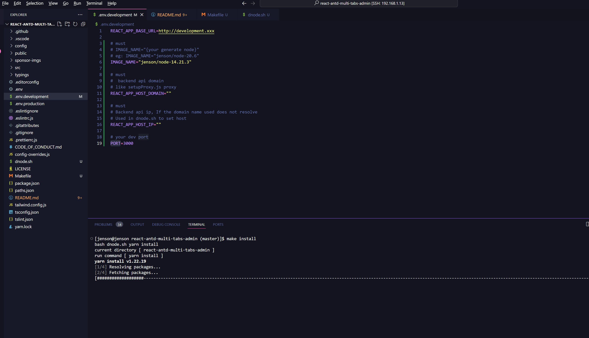
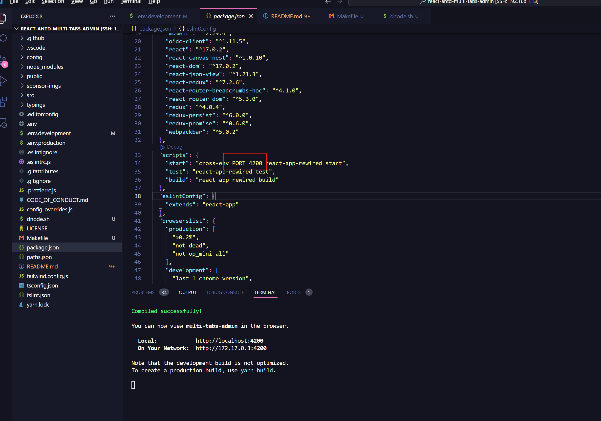
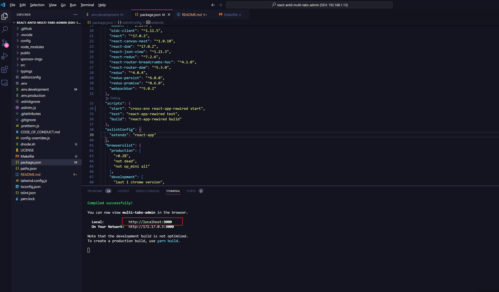
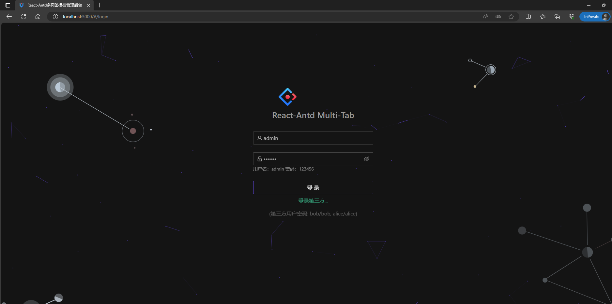

<!-- @import "[TOC]" {cmd="toc" depthFrom=1 depthTo=6 orderedList=false} -->

<!-- code_chunk_output -->

- [Installing Node with Docker](#installing-node-with-docker)
  - [About](#about)
  - [Directory Structure](#directory-structure)
  - [Build](#build)
  - [Usage](#usage)
  - [Example](#example)

<!-- /code_chunk_output -->

# Installing Node with Docker

## About

Resolving Node Multiple Version Issues in Daily Development

## Directory Structure

1. `react`  Scripts and configuration files related to the React project
1. `vue`  Scripts and configuration files related to the Vue project
1. `Dockerfile`  Node Docker Build File
1. `Makefile`

## Build

1. parameters
    1. `NODE_VERSION` node version
        - [see](https://hub.docker.com/_/node/tags?page=1&name=alpine) <https://hub.docker.com/_/node/tags?page=1&name=alpine>
        NODE_VERSION?=20.6.0-alpine3.18
    1. `IMAGE_NAME` image name
        - eg `NODE_VERSION=20.6.0-alpine3.18` So, let's name the image jenson/node-20.6.`
1. command
    - `make add` // Create a default version image
    - `make add NODE_VERSION=20.6.0-alpine3.18 IMAGE_NAME=jenson/node-20.6`

    > The Dockerfile checks the version and automatically selects the appropriate Python version to create.
    > Preferably, choose version 3.15 for building. If you opt for an Alpine version above 3.15, Python will be Python 3. This is mainly to address compatibility issues with previous Node-sass compilation.

1. Remember the name of the built image, for example: jenson/node-17.5. You will need to use IMAGE_NAME below.

## Usage

1. Choose the appropriate configuration directory based on your project framework, either vue or react.
1. **If the target project already has this file, please add it manually. Otherwise, simply copy it.**
1. According to the comments in env.development.example, configure it into .env.development.
1. `make help` show help

## Example

1. `make add NODE_VERSION=14-alpine3.17 IMAGE_NAME=jenson/node-14`
1. git clone [test project](https://github.com/hsl947/react-antd-multi-tabs-admin)
    - `git clone https://github.com/hsl947/react-antd-multi-tabs-admin.git`
1. copy ./react config file
    > Please pay attention to .env.development.
1. set .env.development

    ```.env
      # must
      # IMAGE_NAME="{your generate node}"
      # eg: IMAGE_NAME="jenson/node-20.6"
      IMAGE_NAME="jenson/node-14.21.3"

      # must
      #  backend api domain
      # like setupProxy.js proxy
      REACT_APP_HOST_DOMAIN=""

      # must
      # Backend api ip, If the domain name used does not resolve
      # Used in dnode.sh to set host
      REACT_APP_HOST_IP=""

      # your dev port
      PORT=3000
    ```

1. install node_module `make install`
    - 
1. start `make start`
    - 
      > The 'start' property in package.json has already been configured with a port. You can remove it to proceed.
    - 
      > start success， and you can now view multi-tabs-admin in the browser.
    - 
